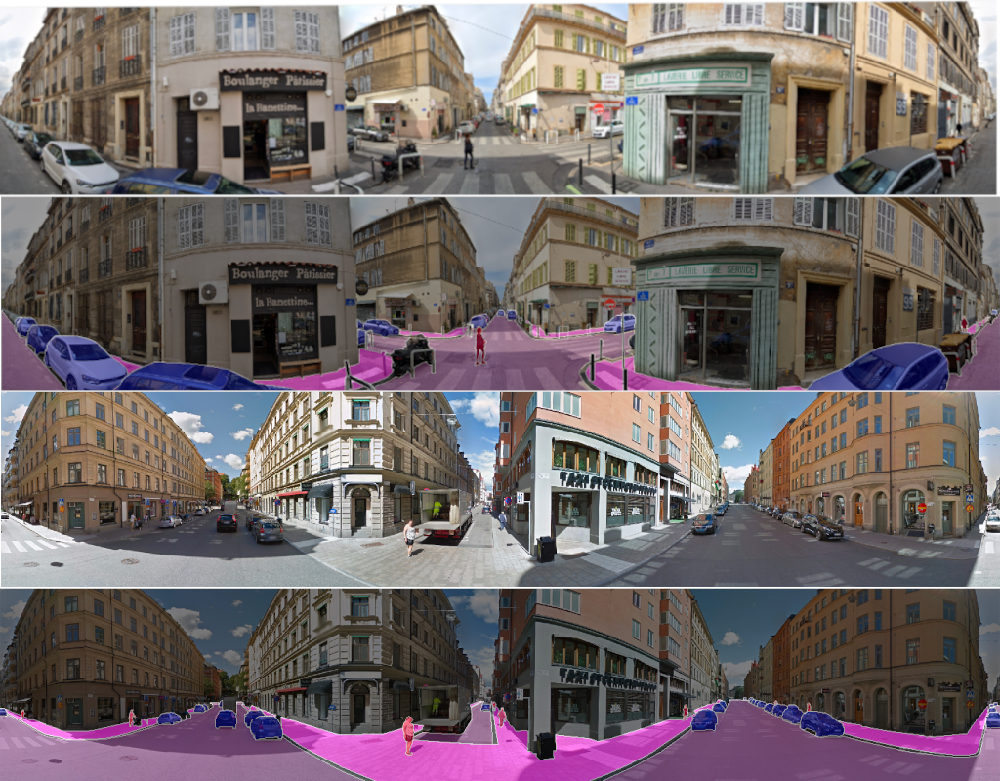

# PPS: Wild Panoramic Panoptic Segmentation dataset

## Google Drive
[Wild PPS dataset on GoogleDrive](https://drive.google.com/file/d/1nv1RuBTQh-A9XFXqyKznLJQ6N5Hl2PuL/view?usp=sharing)
## Description
We provide a diverse dataset consisting of 40 panoramic images from 40 different cities taken from [WildPASS](https://github.com/elnino9ykl/WildPASS) along with panoptic annotation for the most essential street scence classes (Stuff: Road, Sidewalk & Thing: Person, Car) in [cityscapes](https://www.cityscapes-dataset.com) annotation format. 

---

---
## Publication 
If you use our dataset, please consider referencing the following paper

Jaus, Alexander, Kailun Yang, and Rainer Stiefelhagen. "Panoramic Panoptic Segmentation: Towards Complete Surrounding Understanding via Unsupervised Contrastive Learning." arXiv preprint arXiv:2103.00868 (2021). \[[PDF](https://arxiv.org/pdf/2103.00868.pdf)\]
